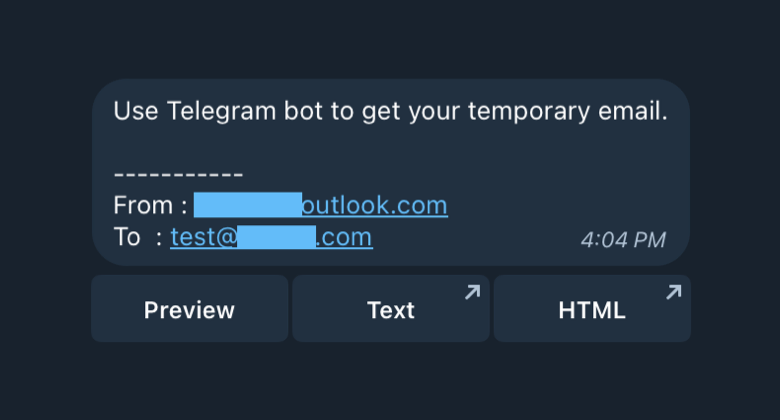
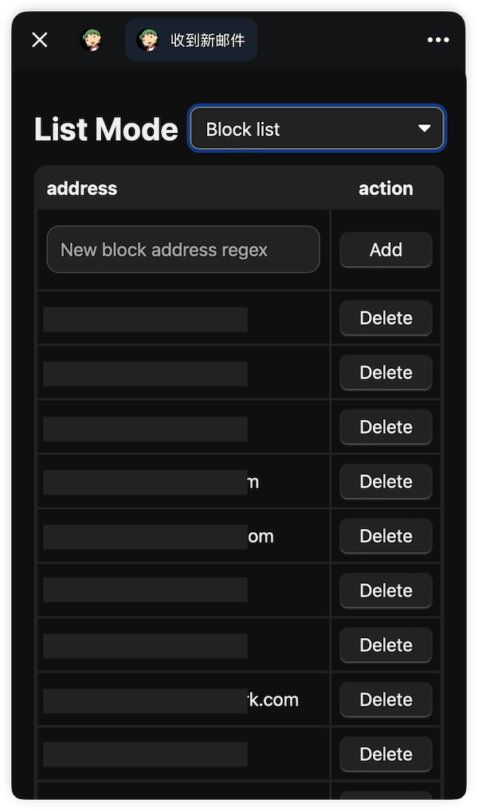
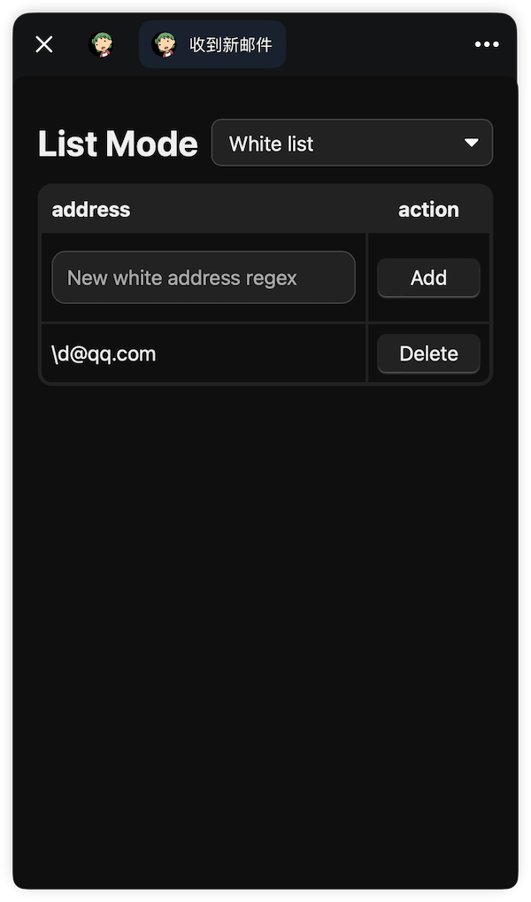
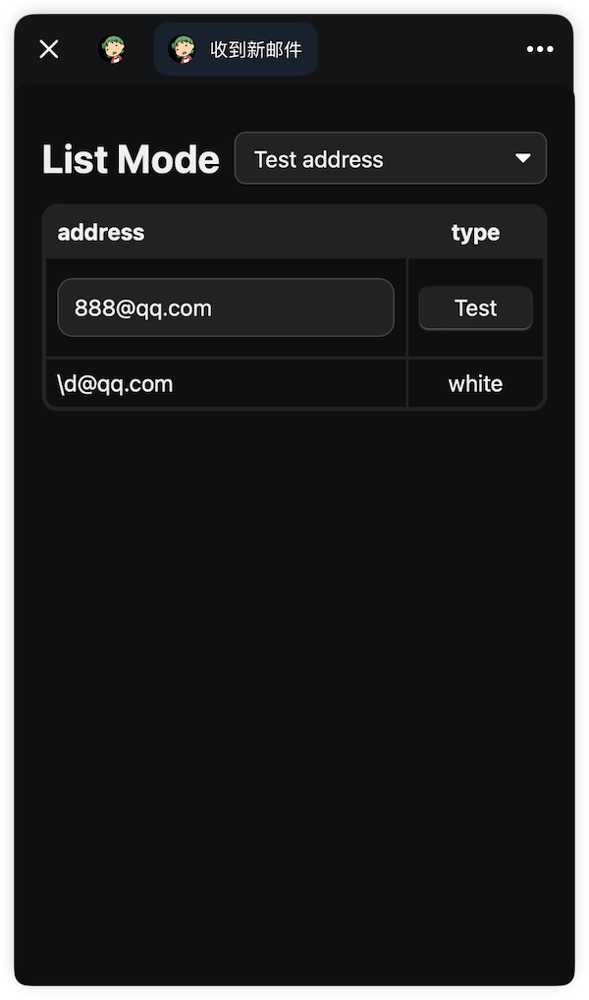

<h1 align="center">
mail2telegram
</h1>

<p align="center">
    <br> English | <a href="doc/README_CN.md">中文</a>
</p>
<p align="center">
    <em>Use Telegram Bot to get your temporary email..</em>
</p>


This is a Telegram Bot based on Cloudflare Email Routing Worker, which can convert emails into Telegram messages. You can forward emails from recipients with any prefix to the Bot, and then a temporary mailbox Bot with an infinite address will be created.

<details>
<summary>Click to view the demo.</summary>

</details>


## Installation

### 0. Configure Telegram

1. Create a bot to obtain a token, use `@BotFather > /newbot`, create a bot and then copy the token.
2. Call `https://project_name.user_name.workers.dev/init` to bind the Webhook, and check the returned result to confirm the binding status.
3. To use Telegram mini programs, you must set a privacy policy. Please visit `@BotFather > /mybots > (select one) > Edit Bot > Edit Privacy Policy`, and then set it to the default privacy policy for Telegram mini programs: `https://telegram.org/privacy-tpa`

### 1. Deploy Workers

#### 1.1 Deploy via Command Line

1. Clone the repository:

    `git clone git@github.com:TBXark/mail2telegram.git`
2. Copy the configuration template and modify it with your own Telegram configuration: 

    `cp wrangler.example.jsonc wrangler.jsonc`
3. Deploy 

    `yarn & yarn pub`

#### 1.2 Deploy via Copy and Paste

1. If you don't want to deploy using the command line and prefer to copy and paste, you can use the precompiled version > [`index.ts`](./build/index.js)
2. When deploying via copy and paste, you need to manually set environment variables in the project's configuration page.
3. Bind `KV Namespace Bindings` database to worker with the name `DB`
4. To generate a whitelist/blacklist of regular expressions as a JSON array string, you can use this small tool which also includes some demos: [regexs2jsArray](https://codepen.io/tbxark/full/JjxdNEX)


### 2. Configure Cloudflare Email Routing

1. Follow the official tutorial to configure [Cloudflare Email Routing](https://blog.cloudflare.com/introducing-email-routing/).
2. Configure routing by changing the action of `Catch-all address` in `Email Routing - Routing Rules` to `Send to a Worker:mail2telegram`. Forward all remaining emails to this worker.
3. If you set `Catch-all address` as workers, you won't be able to forward all remaining emails to your own email. If you need to backup emails, simply fill in your backup email in the `FORWARD_LIST` environment variable of the worker.
4. The email address in `FORWARD_LIST` should be added to `Cloudflare Dashboard - Email Routing - Destination addresses` after authentication in order to receive emails.

### 3. Binding a Telegram Webhook

Call `https://project_name.user_name.workers.dev/init` to bind the Webhook, check the return result to confirm the binding status.

## Configuration

Location: Workers & Pages - your_work_name - Settings - Variables

| KEY                    | Description                                                                                                                                                                                                                                                                                                                                                                                          |
|:-----------------------|:-----------------------------------------------------------------------------------------------------------------------------------------------------------------------------------------------------------------------------------------------------------------------------------------------------------------------------------------------------------------------------------------------------|
| TELEGRAM_ID            | The Chat ID of the destination to sent by the Bot (such as your own Telegram account ID), can be obtained through the bot's `/id` command, which is generally a series of numbers, GROUP's start with -100. Multiple IDs separated by English commas                                                                                                                                                 |
| TELEGRAM_TOKEN         | Telegram Bot Token e.g., `7123456780:AAjkLAbvSgDdfsDdfsaSK0`                                                                                                                                                                                                                                                                                                                                         |
| DOMAIN                 | Workers domain name, e.g., `project_name.user_name.workers.dev`                                                                                                                                                                                                                                                                                                                                      |
| FORWARD_LIST           | Backup emails, can be forwarded to your own email for backup, leave blank if not forwarding, multiple values can be separated by `,`                                                                                                                                                                                                                                                                 |
| ~~WHITE_LIST~~         | **To be deprecated soon, switch to using built-in mini programs for editing.**，Sender whitelist, an array of regular expressions or email address converted to a string, example: `[\".*@10086\\\\.cn\"]`                                                                                                                                                                                            |
| ~~BLOCK_LIST~~         | **To be deprecated soon, switch to using built-in mini programs for editing.**，Sender blacklist, an array of regular expressions or email address converted to a string                                                                                                                                                                                                                              |
| BLOCK_POLICY           | Optional values `reject,forward,telegram`, Separated by commas. `reject` means to reject the email, `forward` means to don't forward mail to backup email, `telegram` means to don't send to telegram. Default is `telegram`                                                                                                                                                                         |
| MAIL_TTL               | Email cache retention time in seconds, default is one day. After expiration, emails will no longer be previewable, please back up.                                                                                                                                                                                                                                                                   |
| WORKERS_AI_MODEL       | Workers AI model identifier. When the Worker binds the `AI` service and this value is set, email summaries will use Workers AI.                                                                                                                                                                                                                                                                       |
| OPENAI_API_KEY         | OpenAI API Key, used for summarizing email content when Workers AI is not available. Without this and `WORKERS_AI_MODEL`, the "Summary" button will not appear.                                                                                                                                                                                                                                       |
| OPENAI_COMPLETIONS_API | Customizable API, default value is `https://api.openai.com/v1/chat/completions`                                                                                                                                                                                                                                                                                                                      |
| OPENAI_CHAT_MODEL      | Customizable model, default value is `gpt-4o-mini`                                                                                                                                                                                                                                                                                                                                                   |
| SUMMARY_TARGET_LANG    | The language for customizing the summary, with a default value of `english`                                                                                                                                                                                                                                                                                                                          |
| GUARDIAN_MODE          | Guard mode, default off, if you want to enable it, fill in `true`.                                                                                                                                                                                                                                                                                                                                   |
| MAX_EMAIL_SIZE         | Maximum email size in bytes, emails exceeding this size will be processed according to `MAX_EMAIL_SIZE_POLICY`. The main purpose is to prevent the worker function from timing out due to too large attachments. Default is 512*1024.                                                                                                                                                                |
| MAX_EMAIL_SIZE_POLICY  | The available values are `unhandled`, `truncate` and `continue`. `unhandled` means return the headers without parsing the message body, `truncate` means truncate the message body and only parse the allowed size, `continue` means continue to process the message regardless of the size limit. The default is `truncate`. This policy only affects Telegram push messages, not email forwarding. |
| RESEND_API_KEY         | Resend API Key, https://resend.com/docs/introduction, Reply message to reply the email.                                                                                                                                                                                                                                                                                                              |
| DB                     | Bind the database to the worker at the `KV Namespace Bindings` section. The `Variable Name` must be `DB`, and `KV Namespace` select any newly created KV.                                                                                                                                                                                                                                            |


## Telegram Mini Apps

The command-based management of black and white lists in the old version has been deprecated. Now, the management of black and white lists is done through a mini-program. The black and white lists in the environment variables cannot be displayed or modified in the mini program.

> To use the telegram-mini-program, you need to re-call the `/init` api to bind the commands.

| block list                         | white list                         | list test                            |
|:-----------------------------------|:-----------------------------------|:-------------------------------------|
|  |  |  |


## Usage

The default message structure is as follows.
```
[Subject]

-----------
From : [sender]
To: [recipient]

(Preview)(Summary)(Text)(HTML)

```
### Email Preview
When the email forwarding notification is sent to Telegram, only the title, sender, recipient, and four buttons are displayed.

1. `Preview` mode: You can preview the plain text mode of the email directly in the bot, but there is a limit of 4096 characters.
2. `Summary` mode: When Workers AI is bound with `WORKERS_AI_MODEL`, summaries are generated by Workers AI. If not, but `OPENAI_API_KEY` is set, OpenAI is used instead. Without either option, the `Summary` button is hidden.
3. `TEXT` mode: Use the web page to view plain text emails, and read emails longer than 4096 characters.
4. `HTML` mode: You can view rich text emails, but they may contain certain scripts or other tracking links. It is recommended to use rich text mode only when necessary or when the source is confirmed to be safe.


### Security and Email Cache
1. `MAIL_TTL`: For security reasons, when the email cache retention time exceeds `MAIL_TTL`, the link that the button jumps to cannot be opened. You can modify the environment variables to adjust the expiration time.
2. Due to Workers restrictions, emails (especially with large attachments) may cause function timeouts and multiple retries, which may result in receiving duplicate notifications. It is recommended to add a backup email to the FORWARD_LIST to prevent email loss.
3. Enabling `GUARDIAN_MODE` can reduce duplicate message interference, improve worker success rate, but will consume more KV write times. It is recommended to enable it when necessary.

### Blacklist and Whitelist
Regarding the matching rules for blacklists and whitelists, taking the whitelist as an example, first, the `WHITE_LIST` will be read from the environment variable and converted into an array. Then, the `WHITE_LIST` will be read from KV and converted into an array. Finally, the two arrays will be merged to obtain the complete whitelist rules. When matching, it will first determine whether the elements in the array are equal to the string to be matched. If they are equal, the match is successful. If they are not equal, the elements in the array will be converted into regular expressions and then matched. If the match is successful, it will return success. If all elements fail to match, it will return failure.

To generate a regular JSON array string for the whitelist/blacklist, you can use this small tool, which also includes several demos. [regexs2jsArray](https://codepen.io/tbxark/full/JjxdNEX)

It is recommended to use a small program to manage the blacklist and whitelist, which can be more convenient to add and delete. The existing blacklist and whitelist in the environment variables will soon be deprecated.

### Email Attachments
This bot does not support attachments. If you need attachment support, you can use my other project [testmail-viewer](https://github.com/TBXark/testmail-viewer) to forward the email to your testmail using `FORWARD_LIST`, so that you can download your attachments using [testmail-viewer](https://github.com/TBXark/testmail-viewer).

## License

**mail2telegram** is released under the MIT license. [See LICENSE](LICENSE) for details.
