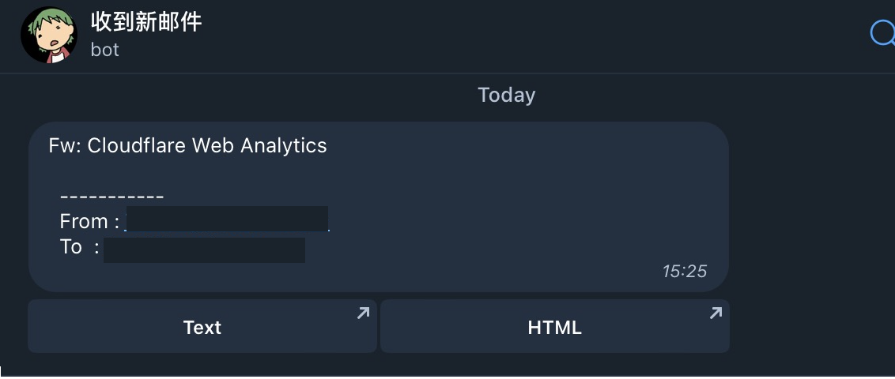

# mail2telegram

这是一个cloudflare email workers,能够将邮件转换成telegram消息。




### 配置

|  KEY    |  描述   |
| ---- | ---- |
| TELEGRAM_ID |   你的Telegram ID   |
| TELEGRAM_TOKEN | Telegram Bot Token |
| DOMAIN  |   Workers的域名  |
| FORWARD_LIST | 备份邮件，可以转发到自己的邮箱备份, 留空则不转发，可以填入多个使用`,`分隔 |
| WHITE_LIST | 发件人白名单，一个正则表达式数组转成字符串 |
| BLOCK_LIST | 发件人黑名单，一个正则表达式数组转成字符串 |
| DB | 绑定 `KV Namespace Bindings` 数据库到worker, 名字必须为`DB` |


### 部署

```shell
git clone git@github.com:TBXark/mail2telegram.git

# 复制配置模板，修改成自己的telegram配置
cp wrangler.example.toml wrangler.toml 

# 部署
yarn & yarn pub

```


### 项目来源

有些时候注册网站需要邮箱地址，但是很多时候不希望使用自己的主要的邮箱地址，这时候就会用一些临时邮箱。但是这些临时邮箱的所有权不在自己手里，一旦需要多次使用某个地址的时候就比较麻烦。当然你也可以利用谷歌邮箱别名获取无限Gmail邮箱, 但是我不想Gmail收到杂乱无章的邮件所以就没有使用了。

这里我自己的方案是使用 Cloudflare Email Routing获得无限地址的企业邮箱，而且每个邮箱地址不用提前设置，你只要随便填写然后他就会像网页路由一样自动选的合适的处理方式。使用详情可以查看官方博客：https://blog.cloudflare.com/zh-cn/introducing-email-routing-zh-cn/

当我们使用了Cloudflare Email Routing的邮箱路由之后，你在注册不同服务商的时候就可以标记来源，比如注册amazon就使用`amazon@example.com`。但是目前Cloudflare Email Router有个缺点就是没有一个收件箱可以查看消息，当然你可以把所有邮件转发到你的另外一个邮箱比如outlook，gmail之类的，然后在他们的网页中查看。但是对于一个临时邮箱来说这一步操作对我来说有一点繁琐。

很幸运的是Cloudflare Email Router支持Worker，这样我们可以对每一封邮件执行我们自己的脚本，[`mail2telegram`](https://github.com/TBXark/mail2telegram)就是这样的一个工具，他可以解析邮件并把标题和预览地址发到你的Telegram。

如果你不喜欢使用Telegram你也可以使用我的另外一个项目[testmail-viewer](https://github.com/TBXark/testmail-viewer),申请一个[testmail](https://testmail.app)，然后把所有的邮件转发到你的testmail，这样你就可以使用[testmail-viewer](https://github.com/TBXark/testmail-viewer)快速查看你的邮件。

当然你也可以将两者结合在一起获得更佳体验, 你只要在`FORWARD_LIST`添加你的testmail地址即可。
